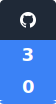

# Custom GitHub Profile Views Badge



Automatically generated vertical badge showing the number of GitHub profile visits, stored in a private Gist.

## 🎯 Features

- ✨ Unique vertical badge design
- 🔄 Automatic update every hour via GitHub Actions
- 🎨 GitHub icon at the top, visit digits below
- 📊 Tracking GitHub profile visits
- 🔐 Data stored in private Gist (doesn't clutter the repository)

## 🚀 Installation

### Step 1: Fork this repository

Click the "Fork" button in the top right corner of this page.

### Step 2: Enable GitHub Actions

1. Go to the **Actions** tab in your fork
2. Click "I understand my workflows, go ahead and enable them"

### Step 3: Add Personal Access Token

1. Go to [GitHub Settings > Developer settings > Personal access tokens > Tokens (classic)](https://github.com/settings/tokens)
2. Click "Generate new token (classic)"
3. Name it: `PROFILE_VIEWS_TOKEN`
4. Select permissions:
   - `repo` (full access to repositories)
   - `gist` (access to manage gists)
5. Click "Generate token" and copy the token
6. In your fork, go to **Settings > Secrets and variables > Actions**
7. Click "New repository secret"
8. Name: `GH_TOKEN`
9. Value: paste the copied token
10. Click "Add secret"

### Step 4: Run workflow manually (first time)

1. Go to the **Actions** tab
2. Select the "Update Profile Views Badge" workflow
3. Click "Run workflow" > "Run workflow"
4. Wait for the workflow to complete
5. Check the logs - you'll find information about the created Gist and its ID

### Step 5: Add GIST_ID to secrets

After the first workflow run, check the logs in Actions. You'll find the message:

```
🔑 IMPORTANT! Save this GIST_ID as a secret in GitHub Actions:
   GIST_ID=xxxxxxxxxxxxxxxxxxxxxxxxxxxxxxxx
```

1. Copy the Gist ID from the logs
2. Go to **Settings > Secrets and variables > Actions**
3. Click "New repository secret"
4. Name: `GIST_ID`
5. Value: paste the copied ID
6. Click "Add secret"

### Step 6: Find the badge URL in Gist

After adding `GIST_ID`, run the workflow again. In the logs, you'll find:

```
🔗 Badge URL: https://gist.githubusercontent.com/USERNAME/GIST_ID/raw/badge.svg
```

### Step 7: Add badge to your profile

Add the following code to README.md in your profile repository (username/username):

```markdown

```

Replace:
- `YOUR_USERNAME` with your GitHub username
- `GIST_ID` with your Gist ID (found in workflow logs)

## 📁 Project Structure

```
CustomBadge/
├── .github/
│   └── workflows/
│       └── update-badge.yml    # GitHub Actions workflow
├── generate-badge.js            # Script generating SVG badge
├── package.json                 # Node.js dependencies
├── badge.svg                    # Generated badge (auto-update)
├── views-count.json             # Visit count (auto-update)
└── README.md                    # This file
```

## 🎨 Badge Appearance

The badge is vertical and consists of:
- Gray section with GitHub icon at the top
- Blue sections with individual digits representing the visit count

## ⚙️ How It Works

1. **GitHub Actions** runs every hour (or manually)
2. **Node.js script** fetches visit statistics:
   - First tries to fetch from profile repository (`username/username`)
   - If not exists, uses statistics from CustomBadge repository
   - Uses GitHub Traffic API to fetch real data
   - In case of error, uses local counter as fallback
3. **Generates SVG** - creates vertical badge with GitHub icon and digits
4. **Saves to Gist** - updates private Gist with `badge.svg` and `views-count.json` files
5. **Auto-update** - badge in README automatically updates from Gist

### Data Source

The badge uses **GitHub Traffic API**, which provides:
- **Total visits** (count) - displayed on the badge
- **Unique visits** (uniques) - logged in console
- **Data from last 14 days** - GitHub API limitation

⚠️ **Note**: GitHub Traffic API shows only visits from the last 14 days. For long-term tracking, data is saved in `views-count.json`.

## 🔧 Configuration

### Update Frequency

Edit the `.github/workflows/update-badge.yml` file:

```yaml
schedule:
  - cron: '0 * * * *'  # Every hour (default)
  # - cron: '0 */6 * * *'  # Every 6 hours
  # - cron: '0 0 * * *'  # Once a day
```

### Change Badge Colors

In the `generate-badge.js` file, you can customize colors:

```javascript
const HEADER_BG = '#1f2937';  // Header background color (GitHub icon)
const DIGIT_BG = '#3b82f6';   // Digit background color
const TEXT_COLOR = '#ffffff'; // Text color
```

### Track Different Repositories

By default, the script tries to fetch statistics from:
1. Profile repository: `username/username`
2. Current repository: `username/CustomBadge`

You can modify the logic in the [`fetchProfileViews()`](generate-badge.js:51) function in the `generate-badge.js` file.

## 🐛 Troubleshooting

### Badge Not Updating

1. Check if the workflow executed: **Actions** → "Update Profile Views Badge"
2. Check workflow logs - did it create/update the Gist
3. Check if `GH_TOKEN` is correctly set in Secrets
4. Check if `GIST_ID` is set (after first run)
5. Ensure the token has `repo` and `gist` permissions

### "Bad credentials" or 401 error

Token expired or lacks permissions. Generate a new token with permissions:
- ✅ `repo` (Full control of private repositories)
- ✅ `gist` (Create and update gists)

### No GIST_ID in logs

Check if:
1. Token has `gist` permissions
2. Workflow executed successfully
3. Logs contain "Creating new private Gist..."

### Badge Not Displaying in README

1. Check if the URL is correct (copied from workflow logs)
2. URL should be in format: `https://gist.githubusercontent.com/USERNAME/GIST_ID/raw/badge.svg`
3. Gist must be created (check at https://gist.github.com/)

### Badge Shows 0 Visits

GitHub Traffic API returns data only from the last 14 days. If the repository is new, the number may be low or zero. The script then uses the local counter.

### Workflow Not Running Automatically

GitHub Actions may disable crons in inactive repositories. Run the workflow manually occasionally or add a commit.

## 📝 License

MIT License - you can freely use and modify this project!

## 🤝 Contributing

Issues and Pull Requests are welcome!

---

## 📸 Usage Example

Add the badge to your profile (in `username/username` repository):

```markdown
## 📊 Profile Stats


```

## 🔍 Why Gist?

- **No repository clutter** - no constant commits every hour
- **Privacy** - Gist is private, only badge.svg is public via raw URL
- **Easier management** - all data in one place
- **Faster updates** - no need to push to repository

---

⭐ If you like this project, leave a star!